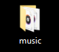
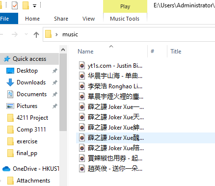
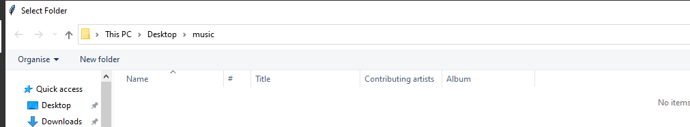
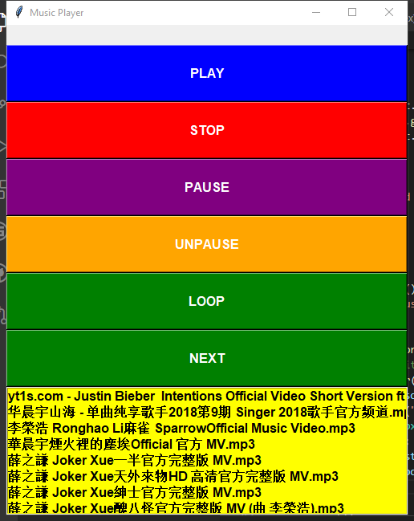

<h1 align="center">Music Player using pygame</h1>
<hr>

### Purpose:

```
Do not want advertisement to interrupt your music.
```
<hr>

### How to run it??

```
- pygame libary installation: py -m pip install -U pygame==1.9.6 --user 
- For pygame installation details :( http://help.codakid.com/en/articles/2551585-how-to-install-pygame)
- Step 1, create a folder and download all the mp4 music file into it.

```




<hr>

```
- Step 2, run music.py file under Visual studio or command prompt (e.g. ./music.py)
- Step 3, Select the folder that you created before
```


<hr>

```
- Finally you can see the UI like the picture shown below
```

```

- Click the music name that you want to play, then Click "Play button"
- Then Click "Loop" if you want to loop your favorite sound!
- btw the whole play list are default loop the whole playlist
- you can click stop if you want to end the program.
```
<hr>
